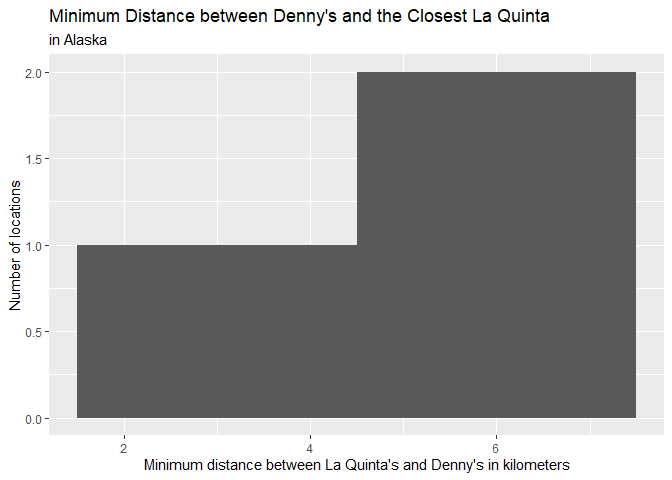
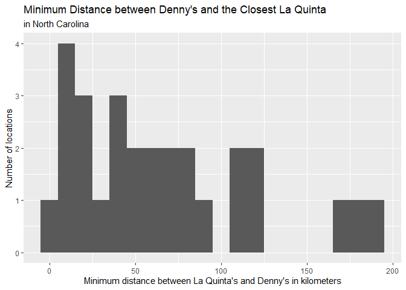
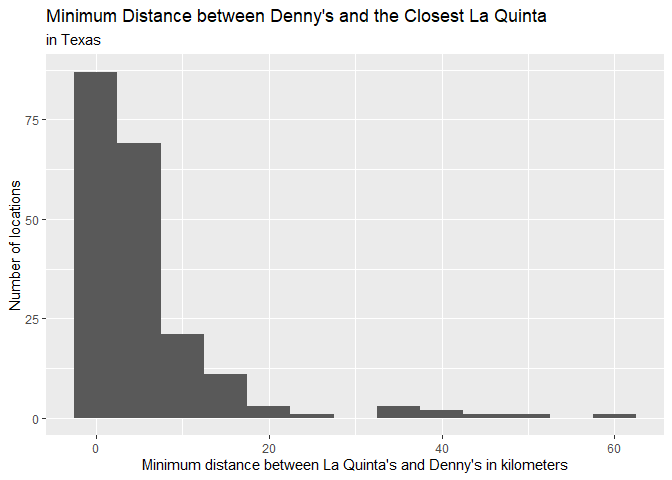
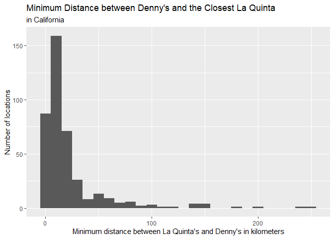
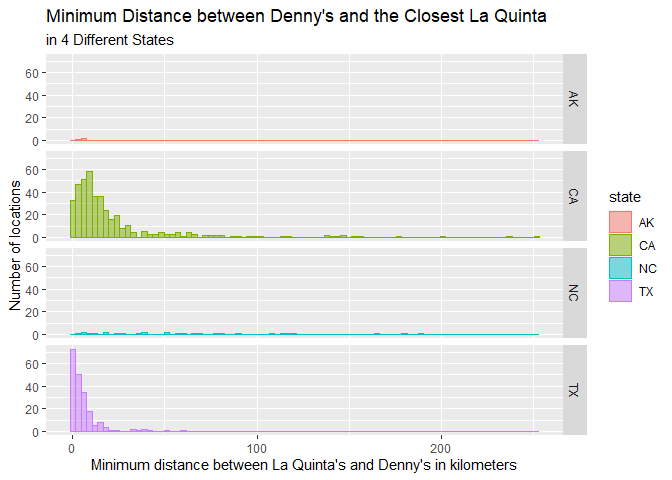

Lab 05- Wrangling spatial data
================
Cat Seitz
01/31/2023

### Load packages and data

``` r
library(tidyverse) 
library(dsbox) 
```

``` r
states <- read_csv("data/states.csv")
```

### Exercise 1

``` r
dn<-dennys

dn_ak <- dn %>%
  filter(state == "AK")
nrow(dn_ak)
```

    ## [1] 3

There are 3 Denny’s locations in Alaska.

### Exercise 2

``` r
lq<-laquinta

lq_ak <- lq %>%
  filter(state == "AK")
nrow(lq_ak)
```

    ## [1] 2

There are 2 La Quinta locations in Alaska.

### Exercise 3

We need to calculate 6 distances between the Alaska establishment
locations.

``` r
dn_lq_ak <- full_join(dn_ak, lq_ak, by = "state")
dn_lq_ak
```

    ## # A tibble: 6 × 11
    ##   address.x      city.x state zip.x longi…¹ latit…² addre…³ city.y zip.y longi…⁴
    ##   <chr>          <chr>  <chr> <chr>   <dbl>   <dbl> <chr>   <chr>  <chr>   <dbl>
    ## 1 2900 Denali    Ancho… AK    99503   -150.    61.2 3501 M… "\nAn… 99503   -150.
    ## 2 2900 Denali    Ancho… AK    99503   -150.    61.2 4920 D… "\nFa… 99709   -148.
    ## 3 3850 Debarr R… Ancho… AK    99508   -150.    61.2 3501 M… "\nAn… 99503   -150.
    ## 4 3850 Debarr R… Ancho… AK    99508   -150.    61.2 4920 D… "\nFa… 99709   -148.
    ## 5 1929 Airport … Fairb… AK    99701   -148.    64.8 3501 M… "\nAn… 99503   -150.
    ## 6 1929 Airport … Fairb… AK    99701   -148.    64.8 4920 D… "\nFa… 99709   -148.
    ## # … with 1 more variable: latitude.y <dbl>, and abbreviated variable names
    ## #   ¹​longitude.x, ²​latitude.x, ³​address.y, ⁴​longitude.y

### Exercise 4

There are 6 observations in our joined data frame, which aligns with
what we want. The variables are the addresses of the Denny’s and La
Quinta locations, as well as their longitudes and latitudes. The data
frame is organized so each row is a pair of Denny’s and La Quinta
locations, with none repeating.

### Exercise 5

``` r
haversine <- function(long1, lat1, long2, lat2, round = 3) {
  # convert to radians
  long1 = long1 * pi / 180
  lat1  = lat1  * pi / 180
  long2 = long2 * pi / 180
  lat2  = lat2  * pi / 180
  
  R = 6371 # Earth mean radius in km
  
  a = sin((lat2 - lat1)/2)^2 + cos(lat1) * cos(lat2) * sin((long2 - long1)/2)^2
  d = R * 2 * asin(sqrt(a))
  
  return( round(d,round) ) # distance in km
}
```

### Exercise 6

I added a column to the Denny’s and La Quinta’s in Alaska data frame for
the distance between each pair of locations.

``` r
dn_lq_ak$distance <-
  haversine(dn_lq_ak$longitude.x,
            dn_lq_ak$latitude.x,
            dn_lq_ak$longitude.y,
            dn_lq_ak$latitude.y,
            3)
```

### Exercise 7

``` r
dn_lq_ak_mindist <- dn_lq_ak %>%
  group_by(address.x) %>%
  summarize(closest = min(distance))
```

### Exercise 8 - Alaska

For each Denny’s location in Alaska, there is a La Quinta within 6
kilometers.

``` r
dn_lq_ak_mindist %>%
  ggplot (aes(x=closest))+
  geom_histogram(binwidth = 3)+
  labs(title = "Minimum Distance between Denny's and the Closest La Quinta",
       subtitle = "in Alaska",
       x="Minimum distance between La Quinta's and Denny's in kilometers",
       y="Number of locations")
```

<!-- -->

``` r
dn_lq_ak_mindist %>% 
  summarize(meandist=mean(closest),
            stddist=sd(closest),
            mindist=min(closest),
            maxdist=max(closest)
          )
```

    ## # A tibble: 1 × 4
    ##   meandist stddist mindist maxdist
    ##      <dbl>   <dbl>   <dbl>   <dbl>
    ## 1     4.41    2.10    2.04    6.00

### Exercise 9 - North Carolina

``` r
#filter dennys
dn_nc <- dn %>%
  filter(state == "NC")

#filter la quinta
lq_nc <- lq %>%
  filter(state == "NC")

#join data frames
dn_lq_nc <- full_join(dn_nc, lq_nc, by = "state")

#calculate distance
dn_lq_nc$distance <-
  haversine(dn_lq_nc$longitude.x,
            dn_lq_nc$latitude.x,
            dn_lq_nc$longitude.y,
            dn_lq_nc$latitude.y,
            3)

#find minimum distance
dn_lq_nc_mindist <- dn_lq_nc %>%
  group_by(address.x) %>%
  summarize(closest = min(distance))

#plot histogram
dn_lq_nc_mindist %>%
  ggplot (aes(x=closest))+
  geom_histogram(binwidth = 10)+
  labs(title = "Minimum Distance between Denny's and the Closest La Quinta",
       subtitle = "in North Carolina",
       x="Minimum distance between La Quinta's and Denny's in kilometers",
       y="Number of locations")
```

<!-- -->

``` r
dn_lq_nc_mindist %>% 
  summarize(meandist=mean(closest),
            stddist=sd(closest),
            mindist=min(closest),
            maxdist=max(closest)
          )
```

    ## # A tibble: 1 × 4
    ##   meandist stddist mindist maxdist
    ##      <dbl>   <dbl>   <dbl>   <dbl>
    ## 1     65.4    53.4    1.78    188.

### Exercise 10 - Texas

``` r
#filter dennys
dn_tx <- dn %>%
  filter(state == "TX")

#filter la quinta
lq_tx <- lq %>%
  filter(state == "TX")

#join data frames
dn_lq_tx <- full_join(dn_tx, lq_tx, by = "state")

#calculate distance
dn_lq_tx$distance <-
  haversine(dn_lq_tx$longitude.x,
            dn_lq_tx$latitude.x,
            dn_lq_tx$longitude.y,
            dn_lq_tx$latitude.y,
            3)

#find minimum distance
dn_lq_tx_mindist <- dn_lq_tx %>%
  group_by(address.x) %>%
  summarize(closest = min(distance))

#plot histogram
dn_lq_tx_mindist %>%
  ggplot (aes(x=closest))+
  geom_histogram(binwidth = 5)+
  labs(title = "Minimum Distance between Denny's and the Closest La Quinta",
       subtitle = "in Texas",
       x="Minimum distance between La Quinta's and Denny's in kilometers",
       y="Number of locations")
```

<!-- -->

``` r
dn_lq_tx_mindist %>% 
  summarize(meandist=mean(closest),
            stddist=sd(closest),
            mindist=min(closest),
            maxdist=max(closest)
          )
```

    ## # A tibble: 1 × 4
    ##   meandist stddist mindist maxdist
    ##      <dbl>   <dbl>   <dbl>   <dbl>
    ## 1     5.79    8.83   0.016    60.6

### Exercise 11 - California

``` r
#filter dennys
dn_ca <- dn %>%
  filter(state == "CA")

#filter la quinta
lq_ca <- lq %>%
  filter(state == "CA")

#join data frames
dn_lq_ca <- full_join(dn_ca, lq_ca, by = "state")

#calculate distance
dn_lq_ca$distance <-
  haversine(dn_lq_ca$longitude.x,
            dn_lq_ca$latitude.x,
            dn_lq_ca$longitude.y,
            dn_lq_ca$latitude.y,
            3)

#find minimum distance
dn_lq_ca_mindist <- dn_lq_ca %>%
  group_by(address.x) %>%
  summarize(closest = min(distance))

#plot histogram
dn_lq_ca_mindist %>%
  ggplot (aes(x=closest))+
  geom_histogram(binwidth = 10)+
  labs(title = "Minimum Distance between Denny's and the Closest La Quinta",
       subtitle = "in California",
       x="Minimum distance between La Quinta's and Denny's in kilometers",
       y="Number of locations")
```

<!-- -->

``` r
dn_lq_ca_mindist %>% 
  summarize(meandist=mean(closest),
            stddist=sd(closest),
            mindist=min(closest),
            maxdist=max(closest)
          )
```

    ## # A tibble: 1 × 4
    ##   meandist stddist mindist maxdist
    ##      <dbl>   <dbl>   <dbl>   <dbl>
    ## 1     22.1    33.0   0.016    253.

### Exercise 12

``` r
dn_lq_ak_mindist<-dn_lq_ak_mindist %>%
  mutate(state="AK")
dn_lq_ca_mindist<-dn_lq_ca_mindist %>%
  mutate(state="CA")
dn_lq_nc_mindist<-dn_lq_nc_mindist %>%
  mutate(state="NC")
dn_lq_tx_mindist<-dn_lq_tx_mindist %>%
  mutate(state="TX")
```

``` r
dn_lq_states <- rbind(dn_lq_ak_mindist, dn_lq_ca_mindist)
df<- rbind(dn_lq_nc_mindist, dn_lq_tx_mindist)

dn_lq_states <- rbind(df, dn_lq_states)
```

``` r
ggplot(dn_lq_states, aes(x=closest, color=state, fill=state)) +
  geom_histogram(alpha=0.5, position="dodge", binwidth=3)+
  facet_grid(state ~ .)+
  labs(title = "Minimum Distance between Denny's and the Closest La Quinta",
       subtitle = "in 4 Different States",
       x="Minimum distance between La Quinta's and Denny's in kilometers",
       y="Number of locations")
```

<!-- -->

In addition to Alaska, Texas, and North Carolina, I examined the minimum
distances between Denny’s and La Quinta’s in California. The joke seems
to best hold true for Texas, as is shown in the last figure. Texas tied
with California for the smallest distance between the 2 establishments,
but Texas’ maximum distance was only 60 kilometers while California’s
was around 250 kilometers. In addition, Texas had, by far, the most
Denny’s locations at very close range to La Quinta’s, while other states
had more variability (excluding Alaska). One could argue the joke best
hold true for Alaska, but given the small sample size, it is unreliable.
